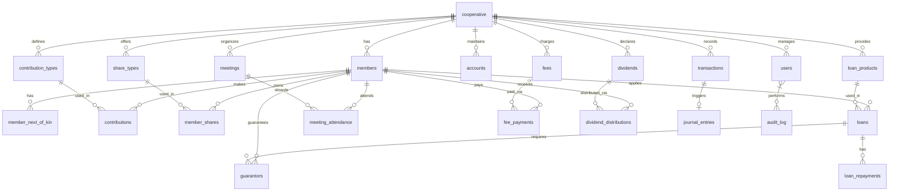

# Cooperative System Database Schema  
 

A **comprehensive relational database schema** for managing cooperative societies (savings & credit unions). Supports member management, contributions, shares, loans, dividends, meetings, accounting, and audit trails.

---

## 📋 Table of Contents
- [Overview](#overview)
- [Database Diagram](#database-diagram)
- [Tables](#tables)
- [Key Features](#key-features)
- [Setup & Migration](#setup--migration)
- [Security & Best Practices](#security--best-practices)
- [Contributing](#contributing)
- [License](#license)

---

## Overview

This schema models a **multi-cooperative platform** where:
- Each cooperative operates independently.
- Members contribute, buy shares, apply for loans, attend meetings, and receive dividends.
- Full double-entry accounting via `journal_entries` and `accounts`.
- Role-based access control (`users`) and audit logging (`audit_log`).

> Designed for scalability, audit compliance, and integration with web/mobile apps.

---

## Database Diagram



> Save as `docs/er-diagram.mmd` and render with [Mermaid Live Editor](https://mermaid.live)

---

## Tables

| Table | Description |
|------|-------------|
| `cooperative` | Core entity: name, registration, status |
| `members` | Member profiles with KYC (NIN/BVN) |
| `member_next_of_kin` | Emergency contact per member |
| `contribution_types` | Recurring or one-off contribution plans |
| `contributions` | Actual payments by members |
| `share_types` | Share classes with pricing |
| `member_shares` | Units purchased by members |
| `loan_products` | Loan packages (tenor, interest, collateral) |
| `loans` | Loan applications & lifecycle |
| `loan_repayments` | Scheduled vs actual repayments |
| `guarantors` | Members guaranteeing loans |
| `transactions` | Unified financial event log |
| `accounts` | Chart of Accounts (COA) |
| `journal_entries` | Double-entry bookkeeping |
| `meetings` | AGM, committee meetings |
| `meeting_attendance` | Sign-in records |
| `fees` | Registration, late, processing fees |
| `fee_payments` | Fee settlement records |
| `dividends` | Annual profit distribution |
| `dividend_distributions` | Per-member payout |
| `users` | System users (admins, tellers, etc.) |
| `audit_log` | Full audit trail with JSON diff |

---

## Key Features

| Feature | Implementation |
|-------|----------------|
| **Multi-Tenancy** | `coop_id` foreign key in all major tables |
| **KYC Compliance** | `id_type`, `id_num`, `photo_url` |
| **Flexible Contributions** | Multiple types & frequencies |
| **Share Capital** | Unit-based, min/max limits |
| **Loan Lifecycle** | Pending → Approved → Active → Closed/Default |
| **Guarantor System** | Self-referencing via `guarantors` |
| **Double-Entry Accounting** | `journal_entries` + `accounts` |
| **Dividend Engine** | Rate-based, tax-deductible |
| **Meeting Management** | Agenda, minutes, digital attendance |
| **Role-Based Access** | `users.role` with scoped `coop_id` |
| **Audit Trail** | `audit_log` with `old_values`/`new_values` in JSON |

---

## Setup & Migration

### 1. Create Database
```sql
CREATE DATABASE Cooperative_System CHARACTER SET utf8mb4 COLLATE utf8mb4_unicode_ci;
USE Cooperative_System;
```

### 2. Run Schema
Save the full `CREATE TABLE` script as `schema.sql`:

```bash
mysql -u root -p Cooperative_System < schema.sql
```

### 3. Recommended Indexes (Add to `indexes.sql`)
```sql
-- Performance boosts
CREATE INDEX idx_members_coop ON members(coop_id);
CREATE INDEX idx_loans_status ON loans(status);
CREATE INDEX idx_contributions_date ON contributions(payment_date);
CREATE INDEX idx_transactions_type ON transactions(type);
CREATE INDEX idx_audit_timestamp ON audit_log(timestamp DESC);
```

---

## Security & Best Practices

| Practice | Recommendation |
|--------|----------------|
| **Passwords** | Store only `password_hash` (use `bcrypt`) |
| **Input Validation** | Enforce at app level (e.g., phone regex, email) |
| **Soft Deletes** | Not used — prefer `status` fields |
| **Backups** | Daily dumps + transaction logs |
| **Encryption** | Encrypt `id_num`, store `photo_url` on secure CDN |
| **Rate Limits** | On login & sensitive actions |
| **Triggers** | Use for auto-journaling on transactions |

---

## Sample Queries

### Get Member Dashboard
```sql
SELECT 
    m.member_no, m.first_name, m.last_name,
    COALESCE(SUM(c.amount), 0) as total_contributions,
    COALESCE(SUM(ms.units * st.unit_price), 0) as share_value,
    COUNT(l.id) FILTER (WHERE l.status = 'active') as active_loans
FROM members m
LEFT JOIN contributions c ON m.id = c.member_id
LEFT JOIN member_shares ms ON m.id = ms.member_id
LEFT JOIN share_types st ON ms.share_type_id = st.id
LEFT JOIN loans l ON m.id = l.member_id
WHERE m.coop_id = 1 AND m.id = 42
GROUP BY m.id;
```

---

## API Integration Tips

| Endpoint | Table(s) |
|--------|---------|
| `GET /members` | `members`, `member_next_of_kin` |
| `POST /contributions` | `contributions`, `transactions` |
| `POST /loans/apply` | `loans`, `guarantors` |
| `GET /reports/dividends` | `dividends`, `dividend_distributions` |

---

## Contributing

1. Fork the repo
2. Create feature branch: `git checkout -b feature/loan-approval-workflow`
3. Add tests or sample data
4. Update docs
5. Submit PR

> See `CONTRIBUTING.md` for details.

---

## License

[MIT License](LICENSE) – Free to use, modify, and distribute.

---

## 📞 Support

- **Issues**: [github.com/yourusername/cooperative-system-db/issues](https://github.com)
- **Discussions**: Enabled for Q&A and feature requests

---

**Built with ❤️ for cooperative societies in Nigeria and beyond.**

---

## Folder Structure (Recommended)

```
cooperative-system-db/
├── README.md
├── LICENSE
├── schema.sql
├── indexes.sql
├── sample-data/
│   └── insert_sample_coop.sql
├── docs/
│   ├── er-diagram.mmd
│   └── data-dictionary.md
├── triggers/
│   └── auto_journal_contribution.sql
└── tests/
    └── test_loan_repayment.sql
```

---

### Next Steps:
1. Create the GitHub repo
2. Push this `README.md` + `schema.sql`
3. Add Mermaid diagram
4. Generate data dictionary (optional)

Let me know if you want:
- Auto-generated **Data Dictionary**
- **SQLAlchemy / Laravel Migration** versions
- **Sample Data Insert Scripts**
- **Dockerized MySQL Setup**

--- 

**You're ready to go live on GitHub!** 🚀
